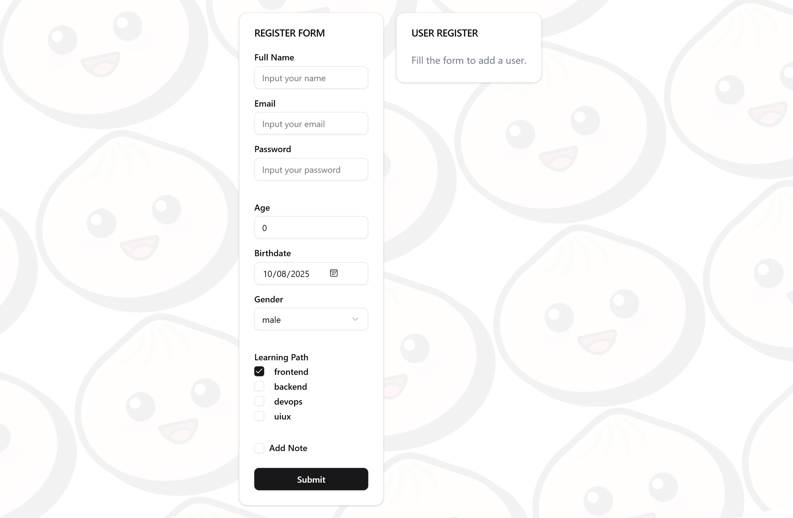
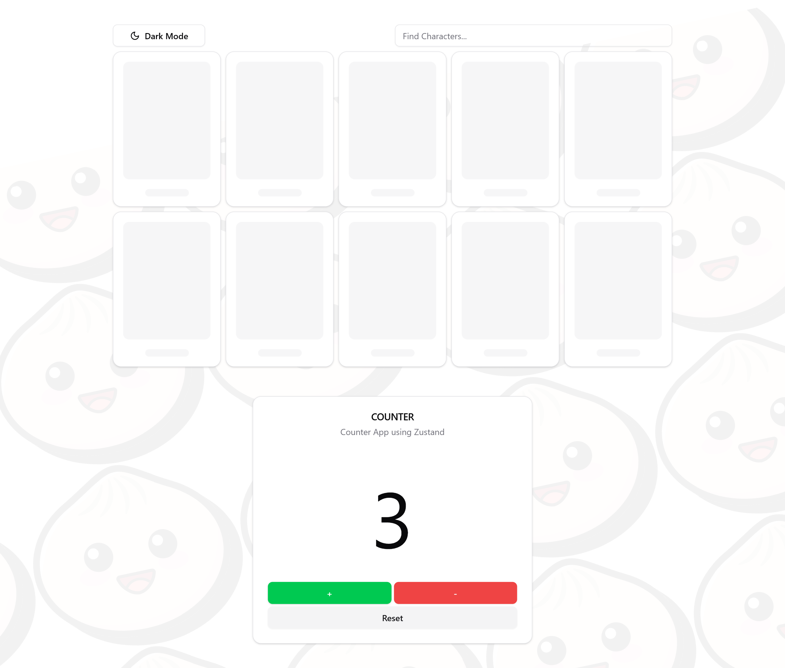
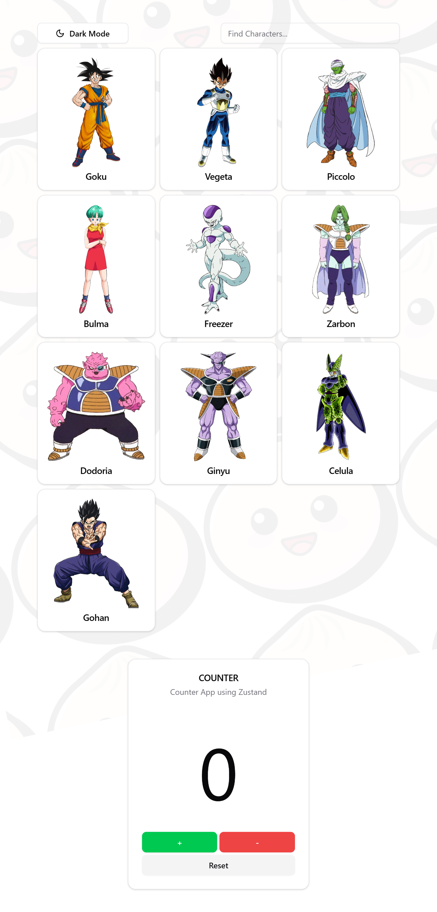
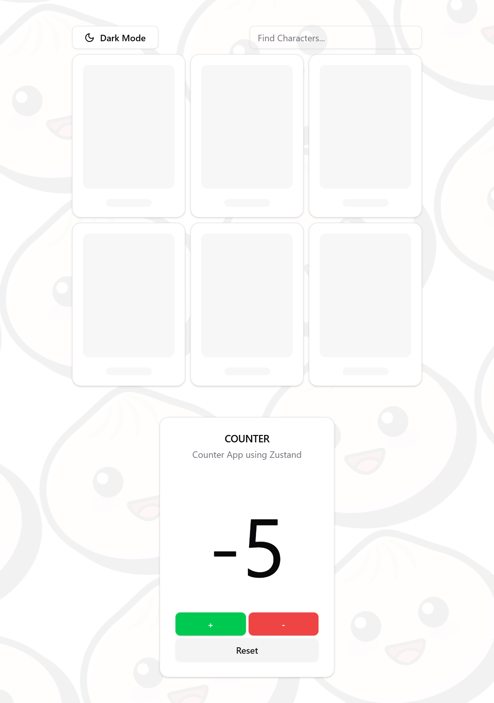
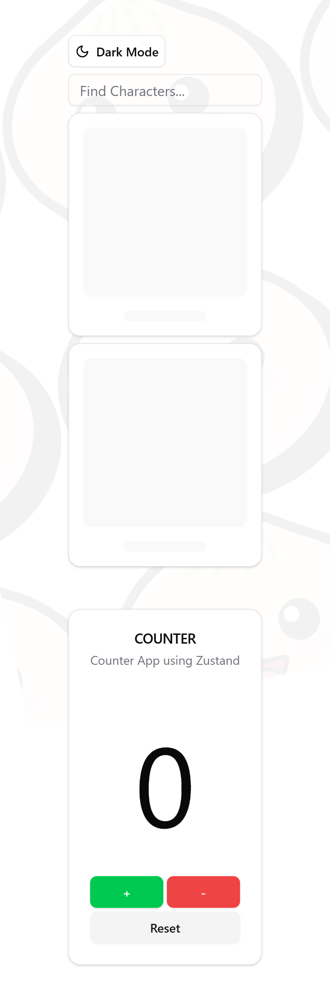
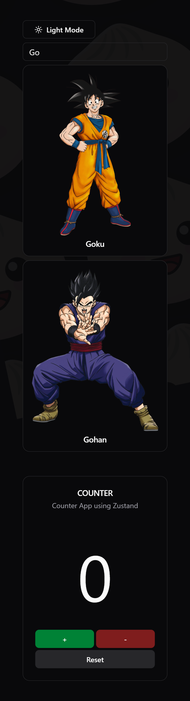

<a id="top"></a>

# Character Explorer & Counter

**React + Zustand + Shadcn UI**

An interactive character card viewer with search, theme toggle, and counter functionality.

A React application that displays character cards fetched from an API with `useEffect`, featuring search with `useMemo`, theme toggling via `useContext`, and a counter state managed by `Zustand`. Built with Shadcn UI components for a modern, responsive design.

---

## ✨ Features
- 🔢 Counter: Increment, decrement, and reset
- 🌍 Global State: Managed with Zustand
- 🔍 Search Characters: Fast filtering using useMemo
- 🌗 Theme Toggle: Light/Dark mode with useContext
- 📱 Responsive UI: Built with Shadcn UI + Tailwind CSS
- ⚡ Fast Build: Powered by Bun

## 🛠️ Built With

- React – UI library
- TypeScript – Typed JavaScript
- Zustand – State management
- Shadcn UI – Modern component library
- Tailwind CSS – Utility-first CSS framework
- Bun – Fast JavaScript runtime

## 📷 Screenshot

### Initial Screen Dekstop


### Loading view and counter increment dekstop


### Initial Screen Tablet


### Loading view and counter decrement tablet


<div style="display: flex; justify-content: center; gap: 20px;">
  <div style="padding: 20px; text-align: center;">
    <h3>Counter reset and loading view mobile</h3>
    
  </div>
  <div style="padding: 20px; text-align: center;">
    <h3>Dark mode search character mobile</h3>
    
  </div>
</div>


<p style="text-align: center; margin-top: 20px;">
  <a href="#top">⬆️ Back to Top</a>
</p>

___

## 🚀 Getting Started

### Install dependencies
```bash
bun install
```

### Run the development server

```bash
bun dev
```
---

## Project Structure

```ts
└── 📁docs   // documentations directory
    └── 📁images
        ├── 01-initial-view-dekstop.png
        ├── 02-loading-card-counter-increase-dekstop.png
        ├── 03-loading-card-counter-decrease-tablet.png
        ├── 04-loading-card-counter-reset-mobile.png
        ├── 05-dark-mode-search-mobile.png
└── 📁src   // Main source directory
    └── 📁components    // Reusable UI components
        └── 📁shared    // Shared components
            ├── ButtonTheme.tsx
            ├── ChararacterCard.tsx
            ├── Counter.tsx
            ├── index.tsx
            ├── SearchBar.tsx
        └── 📁ui    // Shadcn UI components 
            ├── button.tsx  
            ├── card.tsx
            ├── input.tsx
            ├── skeleton.tsx
    └── 📁context   // Custom context
        ├── ThemeContext.tsx
    └── 📁hooks   // Custom hooks
        ├── index.ts
        ├── UseCharacters.tsx
    └── 📁interfaces   // Custom hooks
        ├── character.interface.ts
        ├── index.ts
        ├── theme.interface.ts
    └── 📁lib   // Library functions
        ├── utils.ts    // Utility functions
    └── 📁pages   // Page components
    └── 📁public    // Public assets
        └── 📁images    // Image assets
            ├── logo.svg
            ├── react.svg
        └── 📁styles    // CSS Styles directory
            ├── globals.css
        ├── index.html    // Main HTML file
    └── 📁routes    // Application routes
    └── 📁stores    // Global state management (Zustand)
        ├── counterStore.ts
    └── 📁types   // TypeScript type definitions
        ├── index.ts
        ├── store.type.ts
        ├── theme.type.ts
    ├── APITester.tsx   // API testing component
    ├── App.tsx   // Main application component
    ├── index.ts    // Entry point for the application
    ├── main.tsx    // Main entry file for the React application
├── .env    // Environment variables
├── .gitignore    // Git ignore file
├── build.ts    // Build script
├── bun-env.d.ts    // Type definitions for Bun environment
├── bun.lock    // Bun lock file
├── bunfig.toml   // Bun configuration file
├── components.json   // Shadcn Components configuration
├── package.json    // Project configuration
├── README.md   // Project documentation
└── tsconfig.json   // TypeScript configuration
```

<p style="text-align: center; margin-top: 20px;">
  <a href="#top">⬆️ Back to Top</a>
</p>