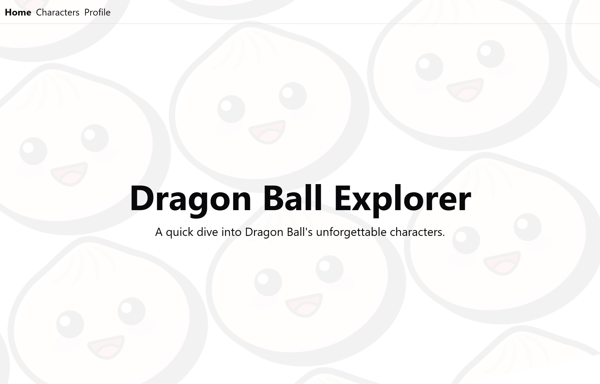
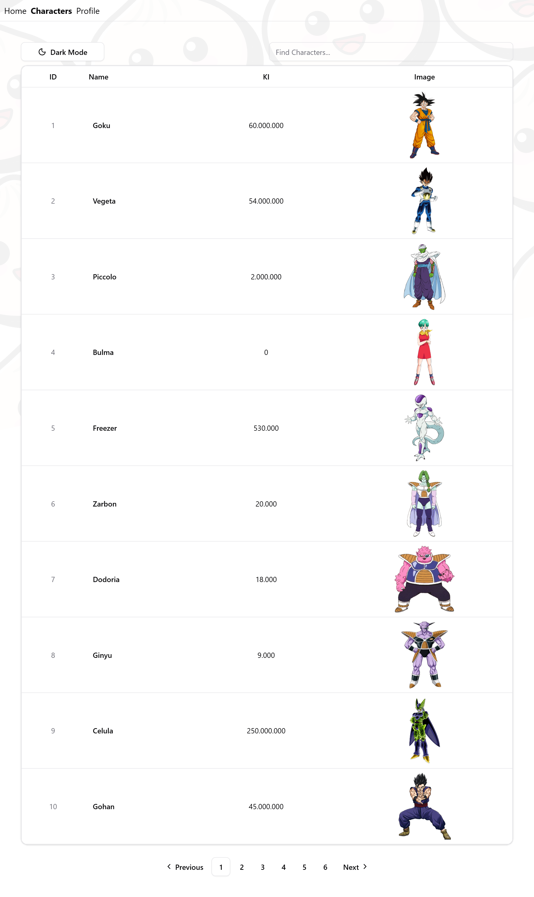
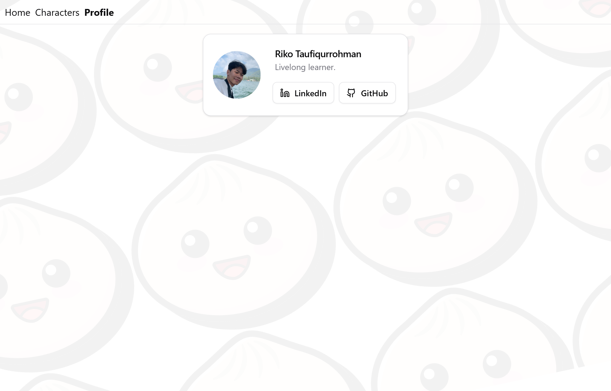
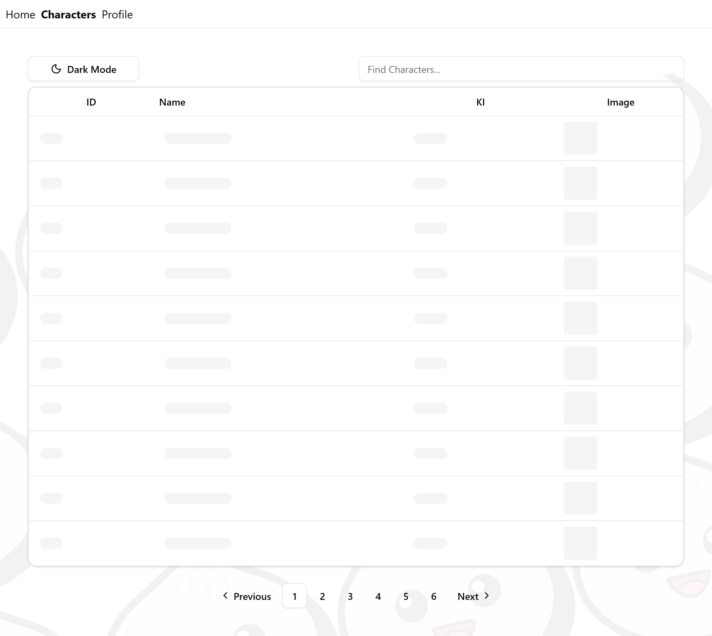
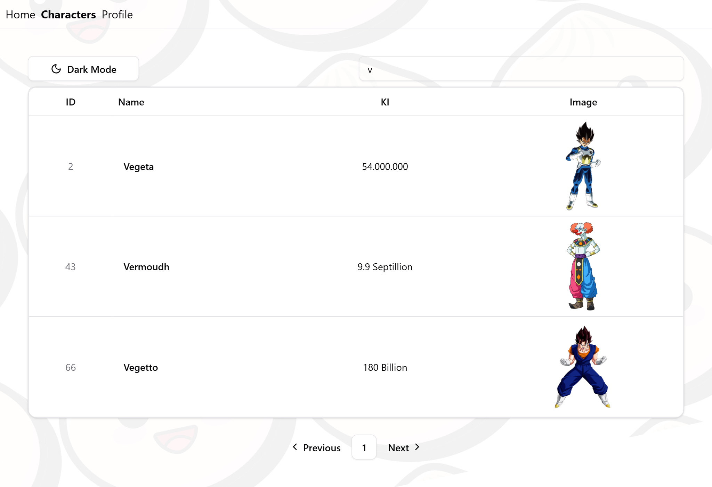
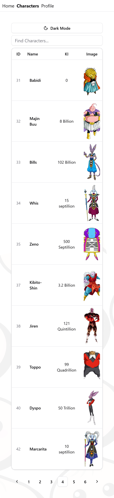

<a id="top"></a>

# Dragonball Character Explorer

**React + TanStack + Shadcn UI**

A React project built with TanStack Router, Query, and Table combined with Shadcn UI to explore Dragon Ball characters.
It features clean routing with TanStack Router, data fetching using Axios with TanStack Query, server-side pagination, dynamic search by name (via query parameters), and a responsive table interface for a smooth browsing experience.

---

## ✨ Features
- 🔍 **Search Characters**: Search by name using query parameters
- 📑 **Pagination**: Server-side pagination with page navigation
- 🗂 **Table View**: Character list displayed using Shadcn Table
- 🌗 **Theme Toggle**: Light/Dark mode with Shadcn + Tailwind
- 🌐 **Routing**: Clean and type-safe navigation with TanStack Router
- 📡 **Data Fetching**: Axios + TanStack Query integration for API calls
- 📱 **Responsive UI**: Built with Shadcn UI + Tailwind CSS
- ⚡ **Fast Build**: Powered by Bun

## 🛠️ Built With
- **React** – UI library
- **TypeScript** – Typed JavaScript
- **TanStack Router** – File-based routing
- **TanStack Query** – Data fetching & caching
- **TanStack Table** – Table rendering and pagination
- **Axios** – HTTP client for API requests
- **Shadcn UI** – Modern component library
- **Tailwind CSS** – Utility-first CSS framework
- **Bun** – Fast JavaScript runtime


## 📷 Screenshot

### Initial Screen Dekstop


### Routing Page Characters


### Routing Page Profile


### Loading Skeleton Character Page


### Search By Name Characters


<div style="display: flex; justify-content: center; gap: 20px;">
  <div style="padding: 20px; text-align: center;">
    <h3>Pagination Characters</h3>
    
  </div>
</div>


<p style="text-align: center; margin-top: 20px;">
  <a href="#top">⬆️ Back to Top</a>
</p>

___

## 🚀 Getting Started

### Install dependencies
```bash
bun install
```
### Add .env
```bash
BUN_PUBLIC_DRAGONBALL_URL=https://dragonball-api.com/api/
```

### Run the development server

```bash
bun dev
```

### Run the production server

```bash
bun start
```
---

## Project Structure

```ts
└── 📁docs   // documentations directory
    └── 📁images
        ├── 01-initial-screen.png
        ├── 02-routing-characters.png
        ├── 03-routing-profile.png
        ├── 04-loading-characters.png
        ├── 05-search-characters.png
        ├── 06-pagination-characters.png
└── 📁src   // Main source directory
    └── 📁components    // Reusable UI components
        └── 📁shared    // Shared components
            └── 📁dragonball
                ├── columns.tsx
                ├── data-table.tsx
                ├── DragonballTable.tsx
            ├── ButtonTheme.tsx
            ├── index.tsx
            ├── Pagination.tsx
            ├── ProfileCard.tsx
            ├── SearchBar.tsx
        └── 📁ui    // Shadcn UI components 
            ├── avatar.tsx  
            ├── button.tsx
            ├── card.tsx
            ├── index.tsx
            ├── input.tsx
            ├── pagination.tsx
            ├── skeleton.tsx
            ├── table.tsx
    └── 📁context   // Custom context
        ├── ThemeContext.tsx
    └── data
        ├── index.ts
        ├── profile.ts
    └── 📁hooks   // Custom hooks
        ├── index.ts
        ├── UseDragonballCharacters.tsx
        ├── UseDragonballCharSearch.tsx
    └── 📁interfaces   // Custom hooks
        ├── base.interface.ts
        ├── character.interface.ts
        ├── dragonball.interface.ts
        ├── index.ts
        ├── pagination.interface.ts
        ├── profile-card.interface.ts
        ├── table.interface.ts
        ├── theme.interface.ts
    └── 📁lib   // Library functions
        ├── api.ts    // Axios config
        ├── index.ts
        ├── utils.ts    // Utility functions
    └── 📁pages   // Page components
    └── 📁public    // Public assets
        └── 📁images    // Image assets
            ├── logo.svg
            ├── profile-picture.jpg
            ├── react.svg
        └── 📁styles    // CSS Styles directory
            ├── globals.css
        ├── index.html    // Main HTML file
    └── 📁routes    // Application routes
        ├── __root.tsx
        ├── characters.tsx
        ├── index.tsx
        ├── profile.tsx
    └── 📁stores    // Global state management (Zustand)
    └── 📁types   // TypeScript type definitions
        ├── dragonball.type.ts
        ├── index.ts
        ├── store.type.ts
        ├── theme.type.ts
    ├── APITester.tsx   // API testing component
    ├── App.tsx   // Main application component
    ├── index.ts    // Entry point for the application
    ├── main.tsx    // Main entry file for the React application
├── .env    // Environment variables
├── .gitignore    // Git ignore file
├── build.ts    // Build script
├── bun-env.d.ts    // Type definitions for Bun environment
├── bun.lock    // Bun lock file
├── bunfig.toml   // Bun configuration file
├── components.json   // Shadcn Components configuration
├── package.json    // Project configuration
├── README.md   // Project documentation
└── tsconfig.json   // TypeScript configuration
```

<p style="text-align: center; margin-top: 20px;">
  <a href="#top">⬆️ Back to Top</a>
</p>