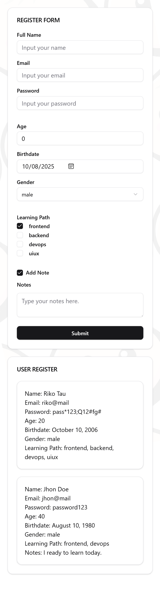
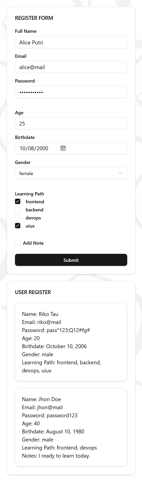
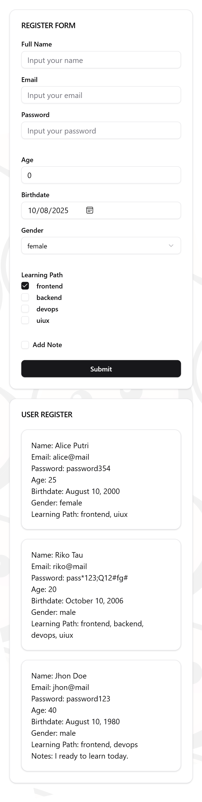

# Register Form { #top }

A responsive registration form built with React, Tailwind CSS, shadcn/ui, and TanStack Form.
Supports mobile and desktop layouts with a clean UI for collecting and displaying user data.

## 🚀 Getting Started

To install dependencies:

```bash
bun install
```

To start a development server:

```bash
bun dev
```

To build the project:

```bash
bun run build
```

To run for production:

```bash
bun start
```

This project was created using `bun init` in bun v1.2.19. [Bun](https://bun.sh) is a fast all-in-one JavaScript runtime.

---

## Project Structure

```ts
└── 📁docs // documentation directory
    └── 📁images
            ├── 01-initial-view-dekstop.png
            ├── 02-complete-form-dekstop.png
            ├── 03-submit-form-dekstop.png
            ├── 04-addsubmit-form-mobile.png
            ├── 05-complete-form-mobile.png
            ├── 06-submit-form-mobile.png
└── 📁src   // Main source directory
    └── 📁components    // Reusable UI components
        └── 📁shared    // Shared components
            ├── index.ts
            ├── RegistrationForm.tsx
        └── 📁ui    // Shadcn UI components
            ├── button.tsx  
            ├── card.tsx
            ├── form.tsx
            ├── index.ts
            ├── input.tsx
            ├── label.tsx
            ├── select.tsx
            ├── sonner.tsx
            ├── textarea.tsx
    └── 📁enum    // enum data
        ├── index.ts
        ├── register-form.enum.ts
    └── 📁interfaces    // Interface for data form
        ├── index.ts
        ├── rergister-form.interface.ts
    └── 📁hooks   // Custom hooks
    └── 📁lib   // Library functions
        ├── utils.ts    // Utility functions
    └── 📁pages   // Page components
    └── 📁public    // Public assets
        └── 📁images    // Image assets
            ├── logo.svg
            ├── profile-picture.jpg
            ├── react.svg
        └── 📁styles    // CSS Styles directory
            ├── globals.css
        ├── index.html    // Main HTML file
    └── 📁routes    // Application routes
    └── 📁stores    // Global state management (Zustand)
    └── 📁types   // TypeScript type definitions
    ├── APITester.tsx   // API testing component
    ├── App.tsx   // Main application component
    ├── index.ts    // Entry point for the application
    ├── main.tsx    // Main entry file for the React application
├── .env    // Environment variables
├── .gitignore    // Git ignore file
├── build.ts    // Build script
├── bun-env.d.ts    // Type definitions for Bun environment
├── bun.lock    // Bun lock file
├── bunfig.toml   // Bun configuration file
├── components.json   // Shadcn Components configuration
├── package.json    // Project configuration
├── README.md   // Project documentation
└── tsconfig.json   // TypeScript configuration
```

[Back to top](#top)

## ✨ Features

* 📝 **User Registration Form** — Simple and clean form to collect user data including name, email, password, birthdate, gender, and learning path.
* ⚙️ **Form Handling with TanStack Form** — Easy form state management and validation-ready setup.
* 🎨 **Styled with Tailwind CSS** — Responsive design that works seamlessly on both mobile and desktop.
* 🔒 **Type-safe with TypeScript** — Ensures predictable and maintainable code.
* ♿ **Accessible UI Components** — Built using [shadcn/ui](https://ui.shadcn.dev/) for a11y best practices.
* 📬 **User Feedback with Toast Notifications** — Instant success message on registration submission.

## 🛠️ Built With

* [React](https://reactjs.org/) — Declarative UI library
* [TypeScript](https://www.typescriptlang.org/) — Static typing for JavaScript
* [Tailwind CSS](https://tailwindcss.com/) — Utility-first CSS framework for styling
* [TanStack Form](https://tanstack.com/table/v8) — Modern form state management and validation
* [shadcn/ui](https://ui.shadcn.dev/) — Accessible, unstyled UI primitives and componentsnotification library
* [Bun](https://bun.sh/) — Fast all-in-one JavaScript runtime

[Back to top](#top)


## 📷 Screenshot

<div style="display: flex; flex-wrap: wrap; justify-content: space-around;">
<div style="flex: 1; min-width: 30%; margin-bottom: 20px; text-align: center;">
<h4>Add Submited Form</h4>

</div>
<div style="flex: 1; min-width: 30%; margin-bottom: 20px; text-align: center;">
<h4>Complete Form</h4>

</div>
<div style="flex: 1; min-width: 30%; margin-bottom: 20px; text-align: center;">
<h4>Submit Form Mobile</h4>

</div>
</div>

[Back to top](#top)
